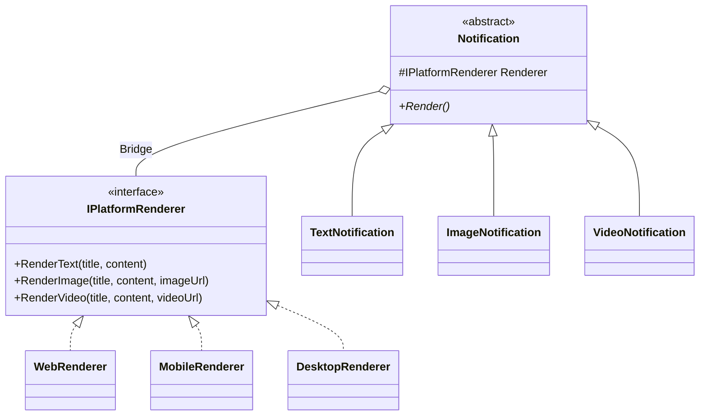

## 🥁 CarnaCode 2026 - Desafio 07 - Bridge

Oi, eu sou o Ronaldo e este é o espaço onde compartilho minha jornada de aprendizado durante o desafio **CarnaCode 2026**, realizado pelo [balta.io](https://balta.io). 👻

Aqui você vai encontrar projetos, exercícios e códigos que estou desenvolvendo durante o desafio. O objetivo é colocar a mão na massa, testar ideias e registrar minha evolução no mundo da tecnologia.

### Sobre este desafio
No desafio **Bridge** eu tive que resolver um problema real implementando o **Design Pattern** em questão.
Neste processo eu aprendi:
* ✅ Boas Práticas de Software
* ✅ Código Limpo
* ✅ SOLID
* ✅ Design Patterns (Padrões de Projeto)

## Problema
Um aplicativo precisa exibir notificações em diferentes plataformas (Web, Mobile, Desktop) com diferentes tipos de conteúdo (Texto, Imagem, Vídeo). 
O código atual cria uma explosão de classes combinando cada tipo de notificação com cada plataforma.

## Solução: Bridge Pattern
O problema de explosão de classes foi resolvido utilizando o padrão **Bridge**. Separamos a abstração (tipo de notificação) da implementação (plataforma de renderização).

### Diagrama de Classes


### Estrutura do Projeto
```
src/
├── Interfaces/
│   └── IPlatformRenderer.cs    # Contrato para implementações de plataforma
├── Notifications/
│   ├── Notification.cs         # Abstração (Bridge)
│   ├── TextNotification.cs     # Abstração Refinada (Texto)
│   ├── ImageNotification.cs    # Abstração Refinada (Imagem)
│   └── VideoNotification.cs    # Abstração Refinada (Vídeo)
├── Renderers/
│   ├── WebRenderer.cs          # Implementação Concreta (Web)
│   ├── MobileRenderer.cs       # Implementação Concreta (Mobile)
│   └── DesktopRenderer.cs      # Implementação Concreta (Desktop)
├── Challenge.cs                # Código Legado (mantido para comparação)
├── Program.cs                  # Ponto de Entrada
└── DesignPatternChallenge.csproj
```

### Classes Criadas
- **Abstração (`Notification`)**: Define a interface de alto nível e mantém uma referência (`_renderer`) para o objeto de implementação.
- **Implementação (`IPlatformRenderer`)**: Define a interface para as classes de implementação.
- **Refinamentos**: `TextNotification`, `ImageNotification`, `VideoNotification` estendem a abstração.
- **Implementações Concretas**: `WebRenderer`, `MobileRenderer`, `DesktopRenderer` implementam a interface de plataforma.

### Etapas de Refatoração
1. **Criação do Projeto**: Configuração do `.csproj` para .NET 10.
2. **Interface de Implementação**: Criação de `IPlatformRenderer`.
3. **Implementações Concretas**: Criação dos renderers para Web, Mobile e Desktop.
4. **Abstração**: Criação da classe base `Notification` recebendo o renderer no construtor.
5. **Refinamento da Abstração**: Criação das classes de notificação específicas.
6. **Integração**: Criação do `Program.cs` demonstrando o uso do padrão e mantendo o legado acessível.

### Como Executar
```bash
cd src
dotnet run
```
A execução exibirá primeiro as notificações utilizando o novo padrão **Bridge**, seguido pela execução do código legado para fins de comparação.


## Sobre o CarnaCode 2026
O desafio **CarnaCode 2026** consiste em implementar todos os 23 padrões de projeto (Design Patterns) em cenários reais. Durante os 23 desafios desta jornada, os participantes são submetidos ao aprendizado e prática na idetinficação de códigos não escaláveis e na solução de problemas utilizando padrões de mercado.

### eBook - Fundamentos dos Design Patterns
Minha principal fonte de conhecimento durante o desafio foi o eBook gratuito [Fundamentos dos Design Patterns](https://lp.balta.io/ebook-fundamentos-design-patterns).

### Veja meu progresso no desafio
[Repositório Central](https://github.com/ronaldofas/balta-desafio-carnacode-2026-central)
